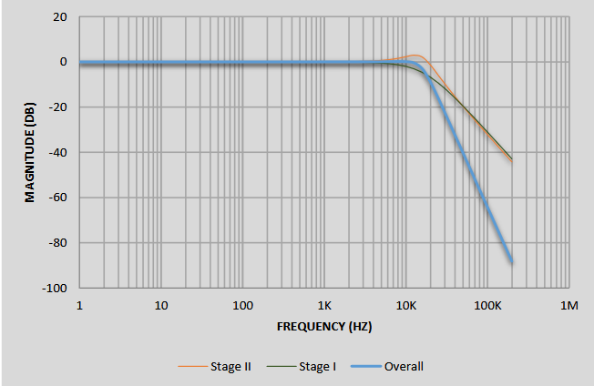

# Group 13 - Parameterizable Live Controlled Synthesizer
=======================
## Dependencies

#### JDK 11 or newer

We recommend using Java 11 or later LTS releases. While Chisel itself works with Java 8, our preferred build tool Mill requires Java 11. You can install the JDK as your operating system recommends, or use the prebuilt binaries from [Adoptium](https://adoptium.net/) (formerly AdoptOpenJDK).

#### SBT or mill

SBT is the most common build tool in the Scala community. You can download it [here](https://www.scala-sbt.org/download.html).
Mill is another Scala/Java build tool preferred by Chisel's developers.
This repository includes a bootstrap script `./mill` so that no installation is necessary.
You can read more about Mill on its website: https://mill-build.org.

#### Verilator

The test with `svsim` needs Verilator installed.
See Verilator installation instructions [here](https://verilator.org/guide/latest/install.html).

## Project Description
This project will use chisel generators, combined with a spreadsheet of required components, to generate a custom hardware synthesizer as defined in the spreadsheet. The synthesizer will have a maximum of 3 voices, which the user can define as sine, square, sawtooth, or triangle. The user can also define an envelope (Attack, Decay, Sustain, and Release parameters) for each voice.

The synthesizer can be connected to a MIDI keyboard, and played live, or it can be connected to a computer and play a sequence of pre-programmed notes.

## Glossary

| Term                   | shorthand | Description                                                                       |
| ---------------------- | --------- | --------------------------------------------------------------------------------- |
| Amplitude              | amp       |                                                                                   |
| Sample rate            |           |                                                                                   |
| Sample                 |           | Signed int value representing audio wave at a single point during the sample rate |
| Phase                  |           |                                                                                   |
| Nyquist frequency      | Nyquist   |                                                                                   |
| Pulse-Width-Modulation | pwm       |                                                                                   |
|                        |           |                                                                                   |
|                        |           |                                                                                   |


## Nexys DDR4 Audio Output Specs

-  Pin A11 is connected to AUD_PWM, which is  the input to an analog low-pass filter$[^1]$


generating a signal is as simple as connecting the output to a PWM generator and setting the duty cycle of the PWM to what frequency we want to produce. sample verilog code included below

```verilog
module pwm_module( 
input clk,
input [10:0] PWM_in, 
output reg PWM_out
);

reg [10:0]new_pwm=0;
reg [10:0] PWM_ramp=0; 
always @(posedge clk) 
begin
    if (PWM_ramp==0)new_pwm<=PWM_in;
      PWM_ramp <= PWM_ramp + 1'b1;
      PWM_out<=(new_pwm>PWM_ramp);
end

endmodule
```

- no hard specs on what frequencies need to be met by hardware, the only caveat is that the datasheet recommends that our PWM frequency be at least one order of magnitude higher than anything we want the audio output to produce. using a system clock of 100MHz to drive the PWM should meet this constraint with plenty of room. 


## Interfaces


## Sources

[^1] https://digilent.com/reference/programmable-logic/nexys-4-ddr/reference-manual
https://digilent.com/reference/programmable-logic/nexys-4-ddr/reference-manual#pulse-width_modulation

